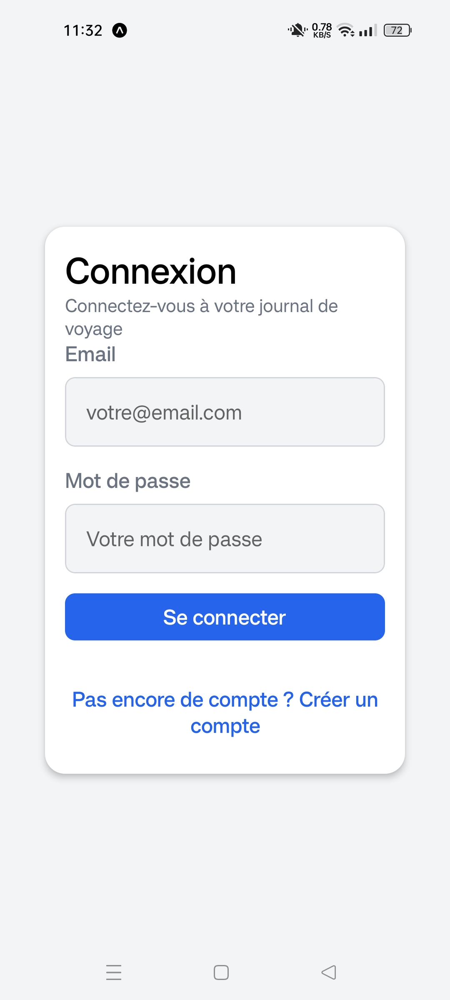
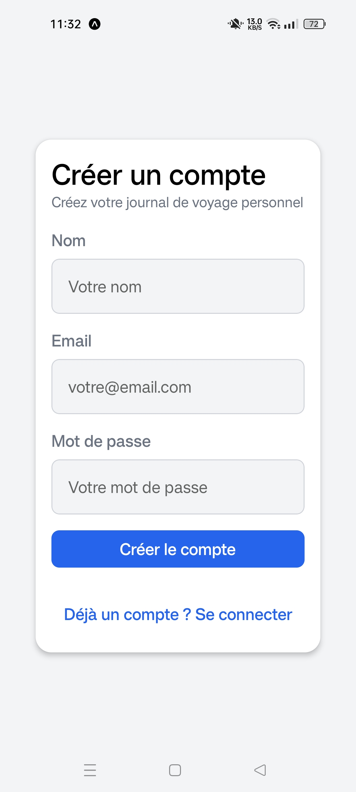
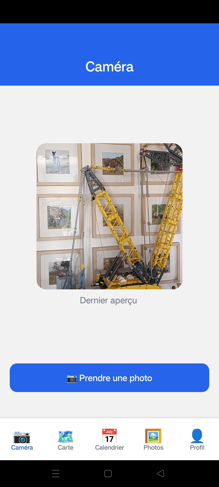
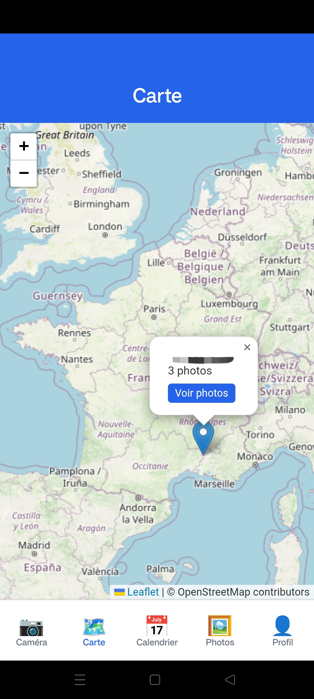
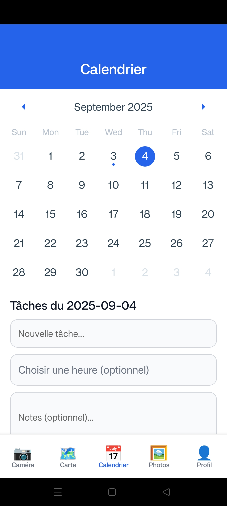
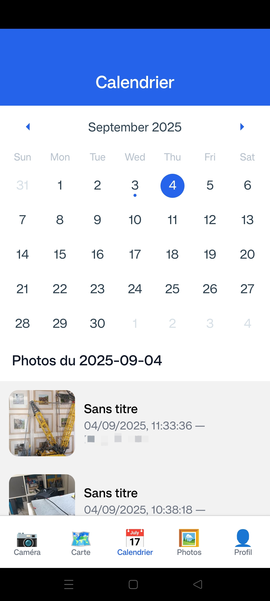
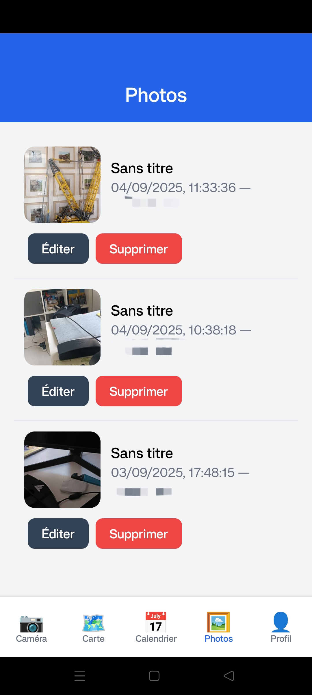
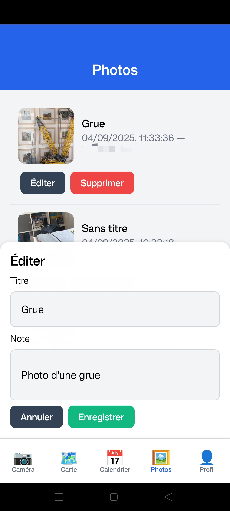
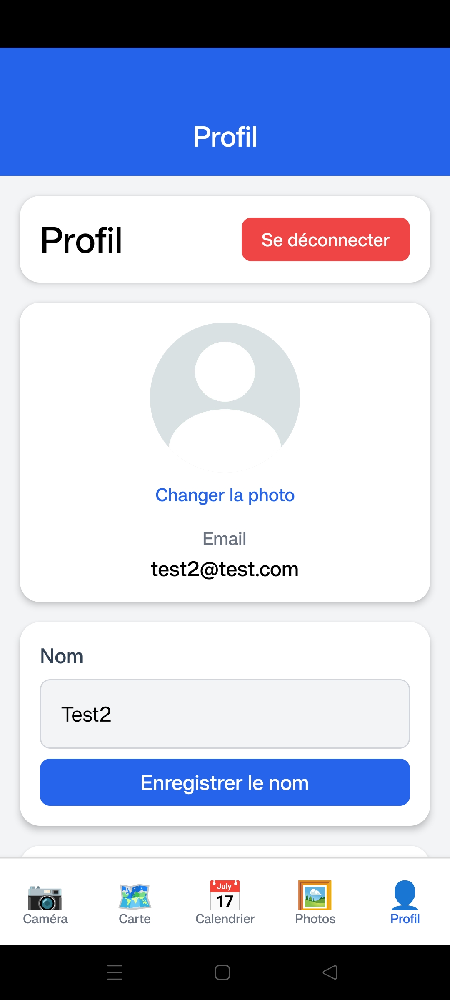
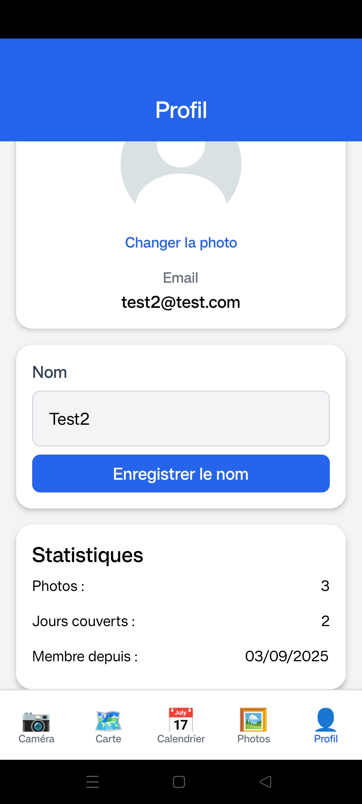

# projetReactNative_photo - Application Mobile de Gestion de Photos

## 📱 Présentation du Projet

projetReactNative_photo est une application mobile développée avec React Native et Expo qui permet aux utilisateurs de capturer, organiser et visualiser leurs photos avec des fonctionnalités avancées de géolocalisation et de planification.

### Fonctionnalités Principales

#### ✅ Fonctionnalités Obligatoires (Terminées)
- **📷 Capture de Photos** : Interface intuitive pour prendre des photos
- **🗺️ Carte Interactive** : Visualisation des photos sur une carte avec géolocalisation via API
- **📅 Calendrier** : Organisation des photos par date avec vue calendaire
- **🖼️ Galerie** : Affichage de toutes les photos capturées
- **👤 Profil Utilisateur** : Gestion des informations personnelles et statistiques

#### ⭐ Fonctionnalités Supplémentaires

##### ✅ Implémentées et Fonctionnelles
- **💾 Stockage Local Persistant** : Sauvegarde automatique des données
- **🔐 Système d'Authentification** : Inscription et connexion sécurisées
- **📝 TodoList Intégrée** : Gestion de tâches avec le calendrier
- **🔔 Système de Notifications** : Notifie l'utilisateur 5 minutes avant l'horaire d'une tâche 

##### ⚠️ En Développement
- **☁️ Synchronisation Cloud** : En cours de développement (branche MPO)
  - ⚠️ Problème de communication avec Firebase en cours de résolution

## 🚀 Installation et Lancement

### Prérequis
- Node.js (version 14 ou supérieure)
- npm ou yarn
- Expo Go (Android) ou Camera App (iOS)

### Installation

1. **Cloner le repository**
   ```bash
   git clone https://github.com/MP-Death30/projetReactNative_photo.git
   cd projetReactNative_photo
   ```

2. **Installer les dépendances**
   ```bash
   npm install
   ```

3. **Lancer l'application**
   ```bash
   npm start
   ```

4. **Scanner le QR Code**
   - **Android** : Utiliser l'application Expo Go
   - **iOS** : Utiliser l'application Camera native

## 📋 Guide d'Utilisation

### Première Connexion

Au premier lancement, vous arriverez sur la page d'authentification :

<div align="center">
  
  
</div>

#### Créer un Compte
1. Cliquez sur "Pas encore de compte ? Créer un compte"
2. Renseignez vos informations :
   - **Nom** : Votre nom complet
   - **Email** : Adresse email valide
   - **Mot de passe** : Minimum 12 caractères avec majuscules, minuscules et caractères spéciaux

#### Connexion Existante
Si vous avez déjà un compte, saisissez simplement votre email et mot de passe.

> 💡 **Note** : Après votre première connexion, vous serez automatiquement connecté avec le dernier compte utilisé.

### Navigation dans l'Application

#### 📷 Page Caméra
Interface de capture photo avec bouton de déclenchement central.

<div align="center"></div>

#### 🗺️ Page Carte
Visualisation interactive des emplacements de prise de vue avec aperçu des photos.

<div align="center"></div>

#### 📅 Page Calendrier
- Vue calendaire des photos par date
- Interface de création et gestion de tâches
- Système de rappels intégré

<div align="center">
  
  
</div>

#### 🖼️ Page Photos
- Galerie complète de vos photos
- Édition des titres et descriptions
- Fonction de suppression

<div align="center">
  
  
</div>

#### 👤 Page Profil
- Informations personnelles
- Statistiques d'utilisation
- Modification de la photo de profil et du nom

<div align="center">
  
  
</div>

## 🏗️ Architecture Technique

### Framework et Outils
- **Framework** : React Native avec Expo
- **Navigation** : React Navigation
- **Stockage Local** : AsyncStorage / Expo SecureStore
- **Géolocalisation** : Expo Location
- **Caméra** : Expo Camera
- **Cartes** : API de cartographie (à spécifier)

### Structure des Données

#### Modèles Principaux
- **User** : Gestion des utilisateurs et authentification
- **Photo** : Métadonnées des images (localisation, date, titre, description)
- **Task** : Système de tâches et rappels
- **Location** : Données de géolocalisation

#### Vues et Templates
- **AuthScreens** : Écrans d'authentification
- **CameraScreen** : Interface de capture
- **MapScreen** : Affichage cartographique
- **CalendarScreen** : Vue calendaire et gestion des tâches
- **GalleryScreen** : Galerie photos
- **ProfileScreen** : Gestion du profil utilisateur

### API et Services
- **Authentication Service** : Gestion des connexions
- **Photo Storage Service** : Stockage et récupération des images
- **Location Service** : Géolocalisation et cartographie
- **Notification Service** : Système de rappels

## 👥 Répartition des Tâches

### 👨‍💼 **Mathis** - *Responsable Projet & Production*
- **Rôle** : Chef de projet et responsable de l'application de production
- **Responsabilités** :
  - Coordination générale du projet
  - Développement des systèmes de stockage (local et cloud)
  - Conception et implémentation du design visuel
  - Gestion de la production et des déploiements

### 👨‍💻 **Romain** - *Développeur Principal*
- **Rôle** : Développeur en chef
- **Responsabilités** :
  - Architecture et fondations de l'application
  - Développement du système d'authentification
  - Implémentation du système de notifications
  - Supervision technique générale

### 👨‍💻 **Deep** - *Développeur Support et QA*
- **Rôle** : Développeur support spécialisé et responsable de l’assurance qualité
- **Responsabilités** :
  - Développement de la page Carte interactive
  - Intégration des API de cartographie
  - Implémentation des fonctionnalités de géolocalisation et l’association des photos aux coordonnées GPS
  - Participer aux activités de tests fonctionnels

### 👨‍💻 **Jules** - *Développeur Support*
- **Rôle** : Développeur support spécialisé
- **Responsabilités** :
  - Développement de la page Carte interactive
  - Communication avec les APIs externes
  - Support au développement des fonctionnalités de mapping

## 🐛 Problèmes Connus et Améliorations

### Issues en Cours
1. **Synchronisation Cloud** : Erreur de communication avec Firebase (branche MPO)

### Prochaines Améliorations
- Finalisation de la synchronisation cloud
- Optimisation des performances
- Tests utilisateur et corrections UX

## 📊 Statistiques du Projet

- **Langage Principal** : JavaScript/TypeScript
- **Framework** : React Native + Expo
- **Nombre de Pages** : 5 pages principales + authentification
- **Fonctionnalités** : 8+ fonctionnalités implémentées
- **Équipe** : 4 développeurs

---

*Développé avec ❤️ par l'équipe projetReactNative_photo*
